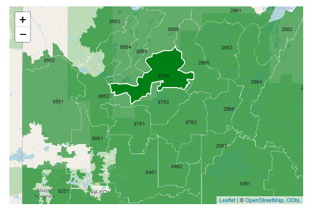
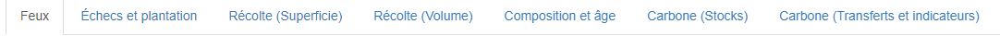

# Résultats

Les résultats du modèle, selon les options sélectionnées, sont compilés par unité d'aménagement (UA) et présentés sous forme de 14 graphiques. Les valeurs affichées dans ces graphiques représentent les moyennes des différentes réalisations (*runs*) du modèle.  

## Carte

{width="441"}

Une carte interactive permet de sélectionner une unité d'aménagement spécifique ou la forêt publique dans son ensemble, pour l'instant représentée comme un carré à l'est de l'ïle d'Anticosti.  

## Graphiques

{width="826"}

Pour faciliter la consultations des résultats, les graphiques ont été regroupés en sept sections, chacune contenant deux graphiques.

### Feux

-   Superficie brûlée

-   Taux de brûlage potentiel en fonction du climat et des combustibles

### Échecs et plantation

-   Superficie affectée par des échecs de régénération

-   Superficie reboisée

### Récolte (Superficie)

-   Impact des feux sur le taux de récolte en superficie (*toutes les réalisations du modèle*)

-   Taux de récolte en superficie par type de peuplement

### Récolte (Volume)

-   Impact des feux sur le taux de récolte en volume (*toutes les réalisations du modèle*)

-   Taux de récolte en volume par type de peuplement

### Composition et âge

-   Taux d'occupation par type de peuplement

-   Taux d'occupation par classe d'âge

### Carbone (Stocks)

-   Stocks de carbone dans la biomasse vivante

-   Stocks de carbone dans le bois mort et les réservoirs du sol

### Carbone (Transferts et indicateurs)

-   Transferts de carbone vers l'atmosphère et les produits du bois

-   Indicateurs d'écosystème  

## Options des graphiques

Les graphiques produits à l'aide du package r [plotly](https://rdocumentation.org/packages/plotly/versions/4.10.4) offrent diverses options d'affichage  
