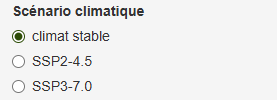
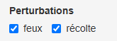
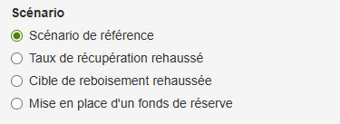

# Options du modèle

## Scénarios climatiques

Trois scénarios climatiques sont disponibles : **"Climat stable"**, **"SSP2-4.5"** et **"SSP3-7.0"**. Ces scénarios influencent deux variables du modèle : la température annuelle moyenne et les précipitations totales annuelles.

Le scénario **"Climat stable"** correspond à la moyenne historique de la période 2016-2020. Les [trajectoires communes d'évolution socio-économiques](https://donneesclimatiques.ca/ressource/comprendre-les-trajectoires-communes-devolution-socioeconomique-ssp/) **SSP2-4.5** et **SSP3-7.0** sont issus des modèles climatiques CMIP6. Leurs valeurs proviennent de l’ensemble de simulations climatiques multimodèles CMIP6 du **Consortium sur la climatologie régionale et l’adaptation aux changements climatiques (Ouranos)**.  

## Perturbations

Deux types de perturbations peuvent être activés ou désactivés dans le modèle : **les feux de forêt** et **la récolte**. 

#### **Feux de forêt**

Les feux de forêt sont simulés selon **13 régimes de feux**, puis compilés par unité d’aménagement. L’historique réel des feux jusqu’en 2024 est intégré au modèle, quelle que soit la combinaison de perturbations sélectionnée.

#### **Récolte**

La récolte inclut les traitements de **coupe totale** et de **coupe partielle**, en fonction du type de peuplement. Lorsqu’elle est activée, le modèle exploite l’ensemble de la **possibilité forestière** par unité d’aménagement.  

## Scénario

Lorsque les feux et la récolte sont activés, une option supplémentaire s'active afin de sélectionner un scénario d'aménagement. Un scénario de référence est disponible, correspondant au type d'aménagement présentement réalisé au Québec, ainsi que trois scénarios fictifs.  

#### **Scénario de référence**

Dans le scénario de référence, les taux de récolte sont définis par **rendement soutenu**, le taux de récupération des brûlis est limité à **20% des superficies brûlées** et les cibles de reboisement par unité d'aménagement sont basées sur les valeurs offertent par le Forestier en chef ([Principales variables forestières associées au calcul (Période 2023-2028)](https://forestierenchef.gouv.qc.ca/wp-content/uploads/SYN-00624-Chiffres-cles-des-possibilites-forestieres-2023-2028-4.12.0.xlsx)). Ces cibles sont intégrées dans le modèle en proportion de la superficie récoltée plutot qu'en valeur brute de superficie.  

#### **Taux de récupération rehaussé**

Pour ce scénario, le taux de récupération des brûlis est limité à **70%** **des superficies brûlées**.  

#### **Cible de reboisement rehaussée**

Pour ce scénario, les cibles de reboisement par unité d'aménagement sont rehaussées à **50% des superficies récoltées en coupe totale**. Pour les UA ayant une cible de reboisement égale ou supérieure à 40%, cette cible est rehaussée de 10%. Pour les unités d'aménagement situées dans des régimes de feux avec des cycles de 300 ans ou moins, les cibles de reboisement ne sont pas rehaussées pour prévenir les risques liés à une quantité trop importante de combustibles.   

#### **Mise en place d'un fonds de réserve**

Pour ce scénario, un fonds de réserve est appliqué aux unités d'aménagement situées dans des régimes de feux avec des cycles de 500 ans ou moins. Ce fonds de réserve représente une **baisse de 10%** par rapport au volume récoltable à la première période de modélisation. Pour les unités d'aménagement situées dans des régimes avec des cycles de 300 ans ou moins, ce fonds est augmenté à **20%** par mesure de précaution additionnelle.  
